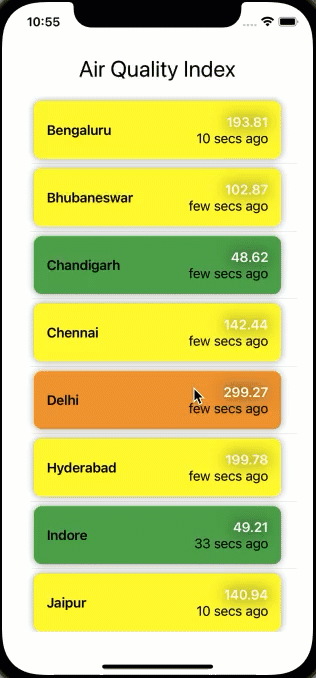

# Clean Breeze - iOS App

iOS app used to list **Air Quality Index** of major Indian Cities.

## Setup

1. Requirements - XCode 12.5.1
2. Open Terminal and run ```pod Install```
4. Open ```CleanBreeze.xcworkspace```
5. Run the app!
## Sample Reference



## Technology Used
1. Developed with **SwiftUI**
2. Used Modular Architecture with **VIPER**
3. **No Third Party Libraries**


